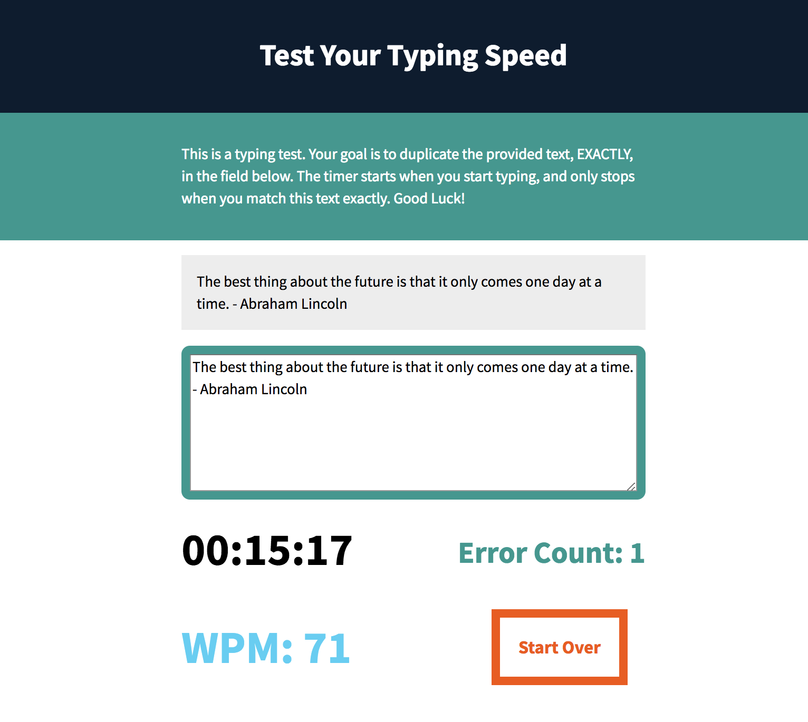

# Typing Test

A browser application to test typing speed and accuracy. Counts the number of typing errors made, calculates Words Per Minute (WPM), and randomizes test text from a collection of over 1600 pithy quotes.

## Visual Design

## User Stories

* On page load, the application fetches a random **new quote** from a JSON with a collection of famous quotes and authors
    * This quote becomes the "test text" which a user must copy exactly
* An event listener **starts the timer** running when the user starts typing
* Another event listener performs a **spellcheck** for every character the user types
    * If an error is made:
        * the color of test area and the error count changes to orange
        * the error count is incremented only once for each error until it is fixed
    * If the user's input text matches the text of the quote thus far
        * the color of the test area turns or remains blue
        * the error count turns or remains green
    * If the user's input text matches the entire quote
        * the timer stops
        * the color of the test area turns green
        * the test area disables user from enter more text
        * a green Words Per Minute element calculates and displays the user's typing speed
* The **reset button** has a third event listener which
    * fetches a new quote and loads it into the app
    * sets the clock back to zero
    * enables typing in the test area again
    * changes the test area border back to grey

